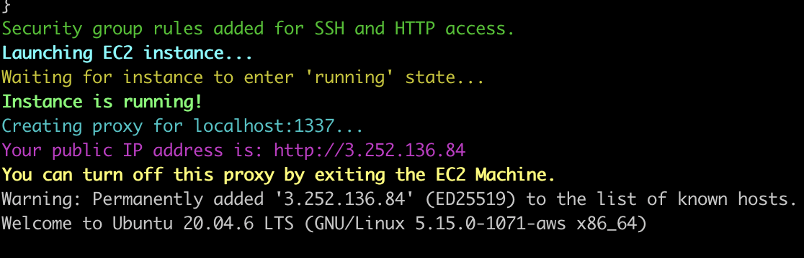
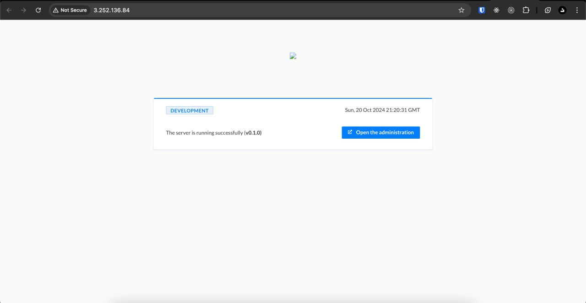

# **nd-mole**

`nd-mole` is a tool that can expose apps that you are running locally on a public IP address. (ex. Running your backend locally and you want it to handle third-party webhooks)

## Overview

`nd-mole` is an Automated EC2 Proxy Setup and Tunneling Script. Bash script designed to automate the creation of an AWS EC2 instance, establish a secure proxy tunnel from the EC2 instance to a local machine, and handle the cleanup of AWS resources once the session ends. It simplifies setting up an Apache-based reverse proxy on an EC2 instance to forward traffic from port 80 (HTTP) on the EC2 instance to a local machine running any service.

### Features

- **Automated EC2 Instance Setup**: Launches a new EC2 instance using the latest Ubuntu AMI.
- **Apache Reverse Proxy**: Configures Apache on the EC2 instance to forward HTTP traffic to a specified local port on your machine.
- **SSH Reverse Tunnel**: Establishes an SSH tunnel to forward traffic from the EC2 instance to your local machine.
- **Automated Cleanup**: Terminates the EC2 instance, deletes the security group, and removes the EC2 key pair when the session ends.

## Prerequisites

1. **AWS CLI**: Set up your AWS configuration
2. **Bash**: This script runs in a Unix-like shell. Use a compatible environment like Linux, macOS, or WSL on Windows.

## Installation

You can include the following commands and links in your documentation to allow users to clone the repository or download the script.

### Updated **Installation** Section

---

## Installation

1. Clone the repository or download this script:

   - `git clone https://github.com/ndinevski/nd-mole.git`

   - Download [nd-mole.sh](https://github.com/ndinevski/nd-mole/blob/master/nd-mole.sh)
2. Make sure the script has execution permissions:

   ```bash
   chmod +x nd-mole.sh
   ```

## Usage

To use `nd-mole`, you simply need to provide a local port number that the proxy should forward traffic to.

### Syntax

```bash
./nd-mole <LOCAL_PORT>
```

### Example

```bash
./nd-mole 1337
```

In this example, the EC2 instance will forward all incoming traffic from port 80 (HTTP) to your local machine's port `1337`.

## How It Works

1. **Key Pair Creation**: A unique key pair is created for each session to allow SSH access to the EC2 instance.
2. **Security Group Creation**: A security group is created to allow SSH (port 22), HTTP (port 80), and tunneling (port 8080) access to the EC2 instance.
3. **EC2 Instance Setup**:
    - Launches a `t2.micro` instance with the latest Ubuntu 20.04 AMI.
    - Installs Apache and configures a reverse proxy to forward traffic from the EC2 instance's port 80 to port 8080.
4. **SSH Tunnel**: Sets up an SSH reverse tunnel, forwarding port 8080 on the EC2 instance to the specified local port on your machine.
5. **Session Management**: The session remains active as long as the SSH tunnel is open.
6. **Automatic Cleanup**: After the session ends (when you exit SSH), the script will delete the key pair, terminate the EC2 instance, and remove the security group.

## Example Output



